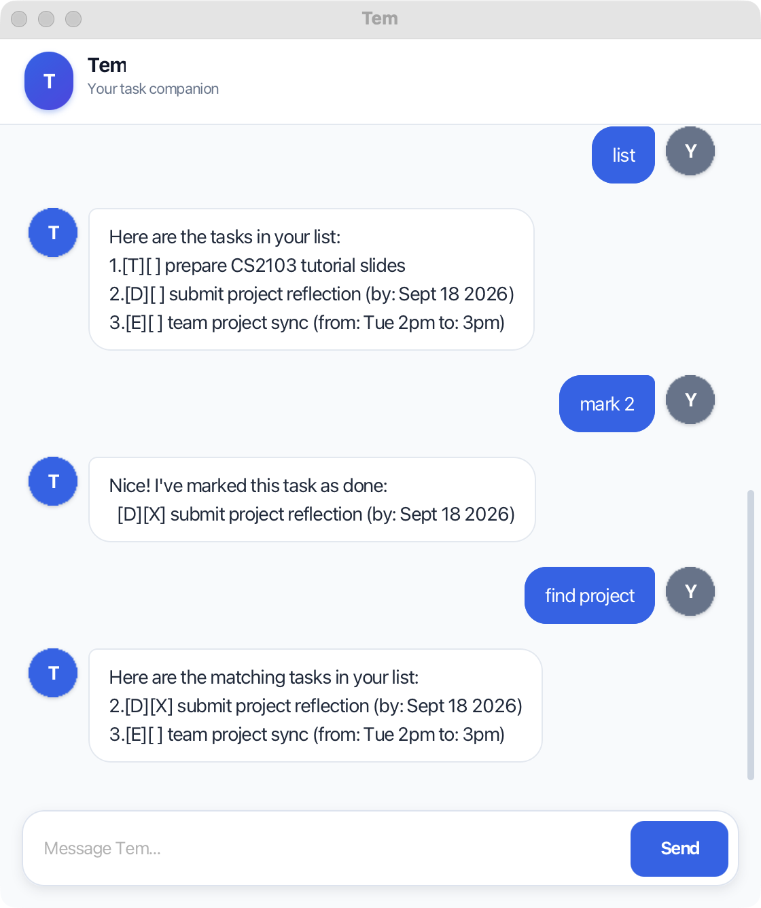

# Tem User Guide

Tem is a friendly task companion for keeping everyday work, deadlines, and
events in one focused chat. Type a command in the message box and press
<kbd>Enter</kbd> or select **Send**.



## Quick start

Tem requires Java 25. From the project folder, start the application with:

```sh
./gradlew run
```

Commands use lowercase keywords. Extra spaces before, after, or within a
command are accepted. Task numbers refer to the numbers shown by `list`.

## Add tasks

### Add a todo

Use a todo for work without a date or time.

```text
todo review tutorial slides
```

### Add a deadline

Use a deadline for work due on a specific date. Dates must use the
`yyyy-MM-dd` format.

```text
deadline submit reflection /by 2026-09-18
```

### Add an event

Use an event for something with a start and end time. The `/from` marker must
come before `/to`.

```text
event project sync /from Tue 2pm /to 3pm
```

Tem prevents accidental duplicates. Two tasks are duplicates when they have
the same type, description (ignoring capitalization), and date or time details.

## View and organize tasks

### List all tasks

```text
list
```

Tem displays each task with its number, type, and completion status. `[ ]`
means incomplete and `[X]` means complete.

### Find tasks

Search task descriptions without worrying about capitalization.

```text
find report
```

### Sort deadlines

Sorts deadline tasks from earliest to latest. Todos and events follow the
deadlines while keeping their existing relative order.

```text
sort
```

## Update tasks

### Mark a task as complete

```text
mark 2
```

### Mark a task as incomplete

```text
unmark 2
```

### Delete a task

```text
delete 2
```

## Common mistakes

Tem keeps your task list safe when a command is incomplete or malformed. For
example, it explains missing task descriptions, invalid dates, duplicate
`/by`, `/from`, or `/to` markers, invalid task numbers, and unsupported
commands. Correct the command and send it again; valid saved tasks are kept.

## Exit Tem

Save your changes and close Tem with:

```text
bye
```

Tasks are saved automatically after you add, mark, unmark, delete, or sort
them. They will still be available the next time you open Tem.
